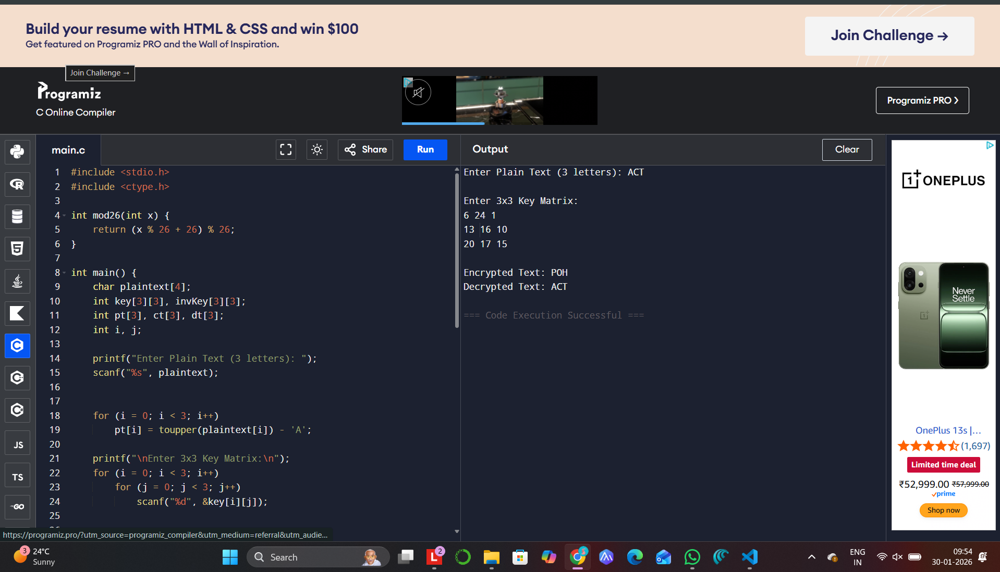

# IMPLEMENTATION OF HILL CIPHER
HILL CIPHER
EX. NO: 3 
## AIM:
 
To write a C program to implement the hill cipher substitution techniques.

## DESCRIPTION:

Each letter is represented by a number modulo 26. Often the simple scheme A = 0, B
= 1... Z = 25, is used, but this is not an essential feature of the cipher. To encrypt a message, each block of n letters is  multiplied by an invertible n × n matrix, against modulus 26. To
decrypt the message, each block is multiplied by the inverse of the m trix used for
 
encryption. The matrix used
 
for encryption is the cipher key, and it sho
 
ld be chosen
 
randomly from the set of invertible n × n matrices (modulo 26).


## ALGORITHM:

STEP-1: Read the plain text and key from the user.

STEP-2: Split the plain text into groups of length three.

STEP-3: Arrange the keyword in a 3*3 matrix.

STEP-4: Multiply the two matrices to obtain the cipher text of length three.

STEP-5: Combine all these groups to get the complete cipher text.

## PROGRAM 
```
#include <stdio.h>
#include <ctype.h>

int mod26(int x) {
    return (x % 26 + 26) % 26;
}

int main() {
    char plaintext[4];
    int key[3][3], invKey[3][3];
    int pt[3], ct[3], dt[3];
    int i, j;

    printf("Enter Plain Text (3 letters): ");
    scanf("%s", plaintext);

    
    for (i = 0; i < 3; i++)
        pt[i] = toupper(plaintext[i]) - 'A';

    printf("\nEnter 3x3 Key Matrix:\n");
    for (i = 0; i < 3; i++)
        for (j = 0; j < 3; j++)
            scanf("%d", &key[i][j]);

   
    for (i = 0; i < 3; i++) {
        ct[i] = 0;
        for (j = 0; j < 3; j++)
            ct[i] += key[i][j] * pt[j];
        ct[i] = mod26(ct[i]);
    }

    printf("\nEncrypted Text: ");
    for (i = 0; i < 3; i++)
        printf("%c", ct[i] + 'A');

   
    int inverse[3][3] = {
        {8, 5, 10},
        {21, 8, 21},
        {21, 12, 8}
    };

    
    for (i = 0; i < 3; i++) {
        dt[i] = 0;
        for (j = 0; j < 3; j++)
            dt[i] += inverse[i][j] * ct[j];
        dt[i] = mod26(dt[i]);
    }

    printf("\nDecrypted Text: ");
    for (i = 0; i < 3; i++)
        printf("%c", dt[i] + 'A');

    return 0;
}

```
## OUTPUT

## RESULT
Thus the c program to implement the hill cipher  is completed and successfully executed
